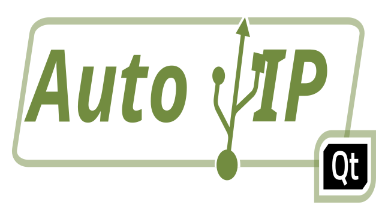
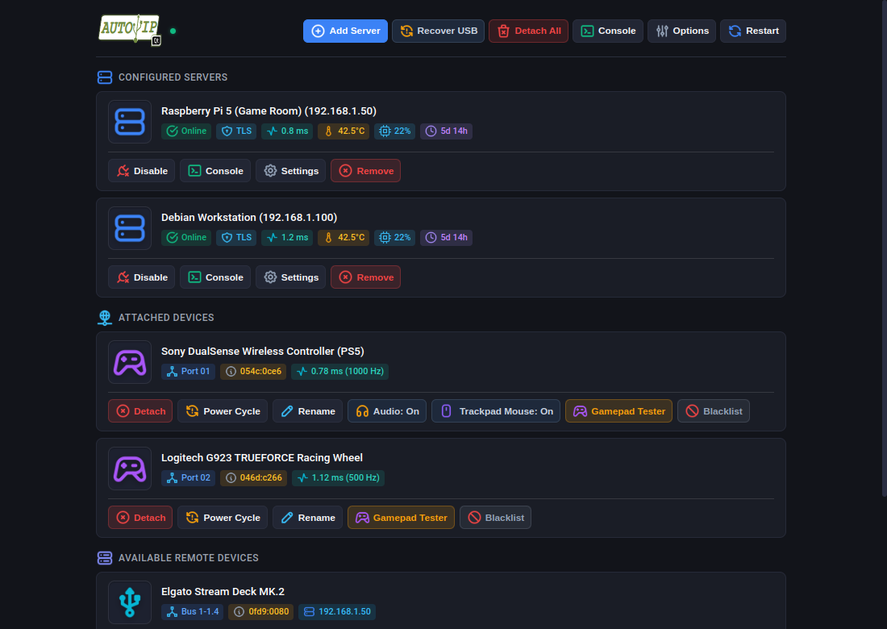
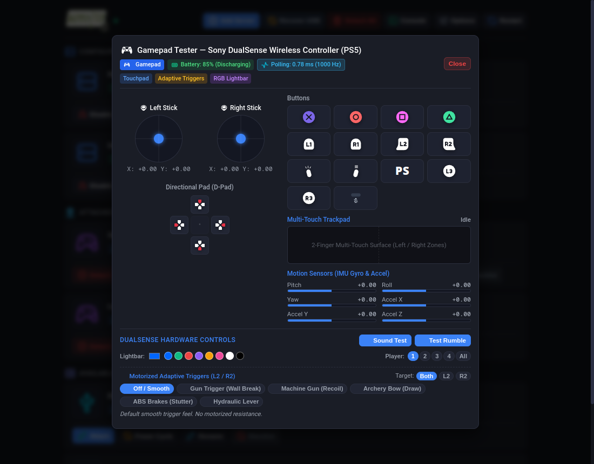
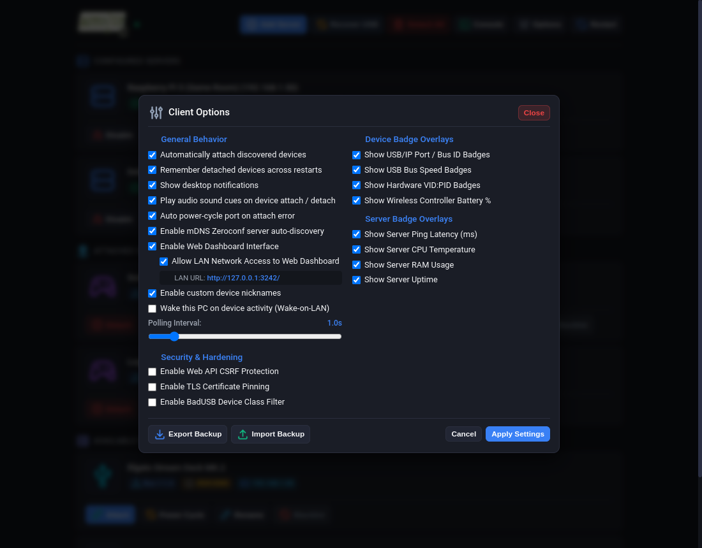
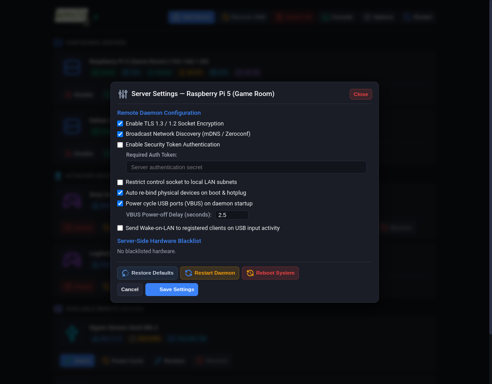
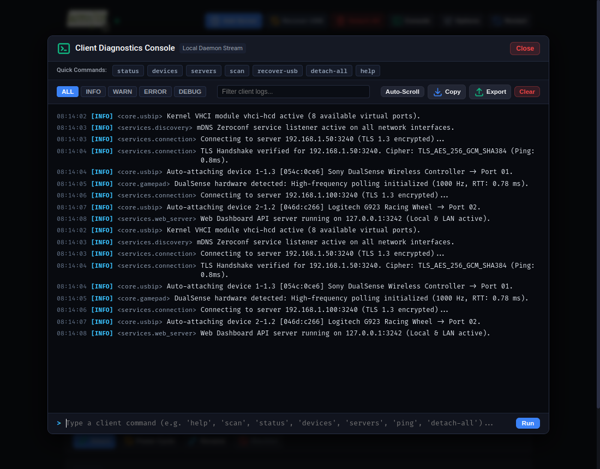

<div align="center">



# Auto USB/IP Qt

**Encrypted USB-over-IP management with ZeroConf discovery, Polkit security, web dashboard, remote server console, and gamepad diagnostics.**

[](https://opensource.org/licenses/MIT)
[](https://www.python.org/downloads/)
[](https://pypi.org/project/PyQt6/)
[](client/security/)
[](dist/)
[](https://github.com/)

[Key Features](#-key-features) • [Screenshots](#-screenshots--ui-tour) • [Architecture](#-architecture) • [Security & Privileges](#-security--privilege-model) • [Server Setup](#-server-installation-raspberry-pi--linux) • [Client Setup](#-client-distribution--installation) • [Gamepad Diagnostics](#-integrated-gamepad-tester) • [Credits & Licenses](#-credits--licenses) • [AI Disclosure](#-ai-assisted-development-disclosure)

</div>

---

## 🚀 Key Features

* ⚡ **Zero-Configuration Server Discovery**: Uses mDNS (Zeroconf / DNS-SD) to discover remote USB/IP servers on the local network automatically.
* 🔒 **Passwordless Polkit Security**:
  * **Polkit D-Bus Policies**: Replaces `sudoers` with granular PolicyKit actions (`org.autousbip.client.*`).
  * **AppArmor Profiles**: Restricts filesystem and capability boundaries for client and server binaries.
  * **udev Access Rules**: Direct non-root access to USB devices and gamepad telemetry via `uaccess`.
  * **Systemd Ambient Capabilities**: Runs daemons with `CAP_NET_ADMIN`, `CAP_SYS_ADMIN`, and `CAP_SYS_RAWIO` without root privileges.
* 🛡️ **Encrypted Control Socket (TLS 1.3 / 1.2)**: Secures control commands, log streaming, and telemetry sockets using TLS certificates and optional pinning.
* 🖥️ **Web Dashboard**:
  * Dark-mode interface accessible locally or across the LAN (`http://<client-ip>:3242/`).
  * Real-time configuration for TLS, discovery, subnet filters, VBUS power delay, auto-attach, and audio cues.
  * **Multi-User Lockout & In-Use Badges**: Displays remote client hostnames on active devices to prevent attach conflicts.
* 📟 **Diagnostic Consoles**:
  * **Client Console**: In-memory log streamer, regex search, log levels, and interactive CLI shell.
  * **Remote Server Console**: Live `journalctl` streaming, CPU temperature/uptime metrics, and remote maintenance commands (`rebind`, `restart`, `reboot`).
* 🎮 **Gamepad Tester**:
  * **Kenney Vector SVG Prompts**: Resolution-independent button prompts for Nintendo, PlayStation, Xbox, and NES/SNES layouts.
  * **`SDL_GameControllerDB`**: Community hardware mapping profiles.
  * Analog stick, trigger, and D-pad evaluation with visual deadzone rendering.
  * Multi-touch trackpad visualizer with absolute touch coordinates.
  * 6-axis IMU accelerometer and gyroscope motion telemetry.
  * **Sony DualSense** hardware controls: RGB lightbar, player LEDs, mic mute button, motorized adaptive triggers, and rumble tests.
* 💤 **Sleep & Wake Auto-Recovery**: Clears zombie connections and re-binds remote USB ports upon system resume using `systemd-login1` D-Bus signals.
* 📦 **Portable Packaging**: Self-contained **AppImage** and portable **Tarball** builds with zero host library requirements.

---

## 📸 Screenshots & UI Tour

<div align="center">

### 🖥️ Main Dashboard & Device Manager
*Dark-mode interface with live server metrics, latency telemetry, attach/detach controls, and USB power cycling.*



<br><br>

### 🎮 Gamepad Latency & Calibration Tester
*Live input telemetry with Kenney vector prompts, deadzone mapping, multi-touch trackpad, 6-axis IMU gyro/accel, and DualSense adaptive triggers.*



<br><br>

### ⚙️ Client Options & Security Settings
*Customization toggles, LAN dashboard sharing, visual badge overlays, and BadUSB hardware class isolation.*



<br><br>

### 🎛️ Remote Server Configuration
*Remote daemon TLS management, mDNS discovery, VBUS reboot delays, and server-side hardware access control.*



<br><br>

### 📟 Diagnostic Console & Live Event Stream
*Interactive developer shell with structured real-time logging, severity level filters, search, and log export.*



</div>

---

## 🏛️ Architecture

```text
┌─────────────────────────────────────────────────────────────────────────┐
│               🖥️ REMOTE SERVER (Raspberry Pi / Linux)                   │
│  ┌───────────────────────────────────────────────────────────────────┐  │
│  │ autousbip.py Background Daemon (systemd + AppArmor + Capabilities)│  │
│  │   • Kernel usbip-host driver (Hardware USB Device Exporter)       │  │
│  │   • TLS Encrypted Control Socket (:3241 - Telemetry, CLI, Rebind) │  │
│  │   • Zeroconf mDNS Broadcaster (:5353 - Network Discovery)         │  │
│  │   • Direct sysfs VBUS Power Control (/sys/bus/usb/devices/...)    │  │
│  └──────────────────────────────────┬────────────────────────────────┘  │
└─────────────────────────────────────┼───────────────────────────────────┘
                                      │
                   TLS 1.3 / 1.2 Encrypted LAN & mDNS
                                      │
┌─────────────────────────────────────┴───────────────────────────────────┐
│                   💻 LOCAL CLIENT (Linux / Windows)                     │
│  ┌───────────────────────────────────────────────────────────────────┐  │
│  │ Auto USB/IP Client (AppImage / Standalone Portable / PyQt6)       │  │
│  │   • Pure-Python mDNS Listener (Automatic Server Discovery)        │  │
│  │   • VHCI Kernel Driver / usbip-win (Virtual USB Port Forwarding)  │  │
│  │   • Embedded Web Dashboard Server (:3242 - Local & LAN Access)    │  │
│  │   • Polkit D-Bus Bridge (Passwordless privileged kernel attaches) │  │
│  │   • Pure Vector SVG Kenney Gamepad Diagnostic Engine              │  │
│  └───────────────────────────────────────────────────────────────────┘  │
└─────────────────────────────────────────────────────────────────────────┘
```

---

## 🛡️ Security & Privilege Model

### 1. Privilege Model
* **Polkit (PolicyKit)**: Rules in [`client/security/polkit/`](client/security/polkit/) allow non-root users to attach/detach kernel USB devices via D-Bus without `sudoers` or root shells.
* **AppArmor MAC Profiles**: Confines client and server binaries on Debian, Ubuntu, and openSUSE ([`client/security/apparmor/`](client/security/apparmor/) & [`server/security/apparmor/`](server/security/apparmor/)).
* **SELinux Policy Modules**: Native CIL & Type Enforcement policies for Fedora, Bazzite, RHEL, and CentOS ([`client/security/selinux/`](client/security/selinux/) & [`server/security/selinux/`](server/security/selinux/)).
* **udev `uaccess` Rules**: Non-root desktop access to physical gamepad telemetry and sysfs nodes ([`client/security/udev/`](client/security/udev/) & [`server/security/udev/`](server/security/udev/)).
* **Security Installer**: Run `./install-security.sh` on client or server to detect and deploy policies automatically.

### 2. Optional Hardening Controls (Configurable in Dashboard)
* 🔒 **Web API CSRF Protection**: Restricts mutating API actions (attach, detach, restart, reboot) to requests originating from verified local origins.
* 🔑 **TLS Certificate Pinning (TOFU)**: Records and validates the SHA-256 fingerprint of the server's TLS certificate on first connect.
* 🦹 **BadUSB Device Class Filtering**: Blocks auto-attaching USB devices by class:
  * Block Mass Storage / Flash Drives (Class 08h)
  * Block Virtual Network / Ethernet / Wi-Fi Adapters (Classes 02h/E0h)
  * Block Raw USB Keyboards (Keystroke Injection defense)
* 🔥 **Server Firewall Setup**:
  ```bash
  sudo bash scripts/setup-firewall.sh 192.168.2.0/24
  ```
  Restricts ports `3240/tcp` (usbip), `3241/tcp` (TLS control), and `5353/udp` (mDNS) to your trusted LAN subnet.

---

## 📦 Server Installation (Raspberry Pi / Linux)

### Option A: Standalone Self-Installing Binary
```bash
# Run in foreground:
sudo ./dist/autousbip-qt-server

# Install as systemd background service (starts on boot):
sudo ./dist/autousbip-qt-server --install

# Uninstall:
sudo ./dist/autousbip-qt-server --uninstall
```

### Option B: Automated 1-Command Web Installer
```bash
curl -fsSL https://raw.githubusercontent.com/marclemieux64/Auto-USB-IP-QT/dev/server/install-server.sh | sudo bash
```

### Option C: Manual Setup
```bash
sudo apt update && sudo apt install -y usbip hwdata openssl uhubctl avahi-utils
sudo cp server/autousbip.py /usr/local/bin/autousbip-qt-server.py
sudo chmod 755 /usr/local/bin/autousbip-qt-server.py
sudo cp server/autousbip.service /etc/systemd/system/autousbip-qt-server.service
sudo systemctl daemon-reload
sudo systemctl enable --now autousbip-qt-server.service
```

---

## 💻 Client Distribution & Installation

Auto USB/IP Client is distributed as a portable **AppImage** and a standalone **Tarball**. It runs on **Ubuntu, Fedora, Arch Linux, Bazzite, SteamOS, Debian, and openSUSE**.

### Option 1: Portable AppImage (Recommended)
```bash
# 1. Ensure kernel VHCI driver is loaded
sudo modprobe vhci-hcd

# 2. Make executable and launch:
chmod +x dist/AutoUSBIP-QT-x86_64.AppImage
./dist/AutoUSBIP-QT-x86_64.AppImage

# 3. (Optional) Integrate into Desktop Application Menu:
./dist/AutoUSBIP-QT-x86_64.AppImage --install

# 4. (Optional) Remove from Desktop Application Menu:
./dist/AutoUSBIP-QT-x86_64.AppImage --uninstall
```

### Option 2: Standalone Portable Tarball (.tar.gz)
```bash
# 1. Extract tarball
tar -xzf dist/AutoUSBIP-QT-x86_64.tar.gz
cd autousbip-qt-client-linux-x86_64

# 2. Run
./autousbip-qt-client

# 3. (Optional) Add to Desktop Application Menu:
./install-menu.sh

# 4. (Optional) Remove from Desktop Application Menu:
./uninstall-menu.sh
```

---

### 🔨 Building Release Artifacts from Source
To build both `AutoUSBIP-QT-x86_64.AppImage` and `AutoUSBIP-QT-x86_64.tar.gz`:
```bash
bash scripts/build-appimage.sh
```
Binary artifacts are written to [`dist/`](dist/).

---

### Windows
1. Install the [usbip-win](https://github.com/cezanne/usbip-win) signed VHCI driver.
2. In the `client/` folder:
   ```cmd
   python -m venv venv
   . env\Scripts\pip install -r requirements.txt
   . env\Scripts\python client.py
   ```

---

## 🎮 Integrated Gamepad Tester

Click **Test Gamepad** on any attached controller to open diagnostics:

* **Vector SVG Visuals**: Powered by Kenney vector input prompts, scaling to any resolution.
* **Controller Identification**: Matches hardware signatures against `SDL_GameControllerDB` for button layouts (Nintendo A/B/X/Y, PlayStation Cross/Circle/Square/Triangle, Xbox A/B/X/Y, NES/SNES).
* **Sensors & Telemetry**:
  * `Touchpad`: Absolute multi-touch coordinates and click state.
  * `Accelerometer`: 3-axis gravity and tilt forces in m/s².
  * `Gyroscope`: 3-axis rotational velocity in rad/s.
  * `Adaptive Triggers`: Position resistance, machine-gun recoil, and feedback triggers.
  * `RGB Lightbar`: 24-bit customizable illumination and player LEDs.

---

## 📜 Credits & Licenses

This project is open-source software licensed under the **[MIT License](LICENSE)**.

### Upstream Lineage & Attribution
* **Original Project**: Derived and expanded from [`florianL21/auto-usbip`](https://github.com/florianL21/auto-usbip) (MIT License, Copyright © 2023 florianL21).

### Third-Party Assets & Libraries
* **[Kenney Input Prompts](https://kenney.nl/assets/input-prompts)**: Gamepad button, stick, and trigger vector graphics by **Kenney** ([CC0 1.0 Universal — Public Domain](https://creativecommons.org/publicdomain/zero/1.0/)).
* **[SDL_GameControllerDB](https://github.com/mdqinc/SDL_GameControllerDB)**: Community database of game controller mappings ([zlib License](https://github.com/mdqinc/SDL_GameControllerDB/blob/master/LICENSE)).
* **[Linux USB ID Repository](http://www.linux-usb.org/usb.ids)**: USB vendor and device identity dictionary ([GPL-2.0 / 3-Clause BSD](http://www.linux-usb.org/)).
* **[PyQt6 & Qt Framework](https://pypi.org/project/PyQt6/)**: Python GUI & WebEngine bindings by Riverbank Computing & The Qt Company ([GPL v3 / LGPL v3](https://www.riverbankcomputing.com/software/pyqt/license)).
* **[python-zeroconf](https://github.com/python-zeroconf/python-zeroconf)**: Pure-Python Multicast DNS Service Discovery library ([LGPL-2.1+](https://github.com/python-zeroconf/python-zeroconf/blob/master/COPYING)).
* **[pyserial](https://github.com/pyserial/pyserial)**: Python Serial Port Extension library ([BSD-3-Clause](https://github.com/pyserial/pyserial/blob/master/LICENSE.txt)).
* **[pyudev](https://github.com/pyudev/pyudev)**: Pure-Python libudev binding for hardware device management ([LGPL-2.1+](https://github.com/pyudev/pyudev/blob/master/COPYING)).

---

## 🤖 AI-Assisted Development Disclosure

In the spirit of open-source transparency:
* This project was designed, co-authored, and refactored with the assistance of **Google DeepMind / Antigravity AI** coding models.
* AI pair programming was used for modularization, diagnostic protocol design, multi-touch event decoders, SDL database integration, and UI design.
* Third-party libraries and assets were vetted for license compatibility.

---

## 📄 License

```text
MIT License

Copyright (c) 2023 florianL21
Copyright (c) 2026 Marc Lemieux & Contributors

Permission is hereby granted, free of charge, to any person obtaining a copy
of this software and associated documentation files (the "Software"), to deal
in the Software without restriction, including without limitation the rights
to use, copy, modify, merge, publish, distribute, sublicense, and/or sell
copies of the Software, and to permit persons to whom the Software is
furnished to do so, subject to the following conditions:

The above copyright notice and this permission notice shall be included in all
copies or substantial portions of the Software.

THE SOFTWARE IS PROVIDED "AS IS", WITHOUT WARRANTY OF ANY KIND, EXPRESS OR
IMPLIED, INCLUDING BUT NOT LIMITED TO THE WARRANTIES OF MERCHANTABILITY,
FITNESS FOR A PARTICULAR PURPOSE AND NONINFRINGEMENT. IN NO EVENT SHALL THE
AUTHORS OR COPYRIGHT HOLDERS BE LIABLE FOR ANY CLAIM, DAMAGES OR OTHER
LIABILITY, WHETHER IN AN ACTION OF CONTRACT, TORT OR OTHERWISE, ARISING FROM,
OUT OF OR IN CONNECTION WITH THE SOFTWARE OR THE USE OR OTHER DEALINGS IN THE
SOFTWARE.
```
